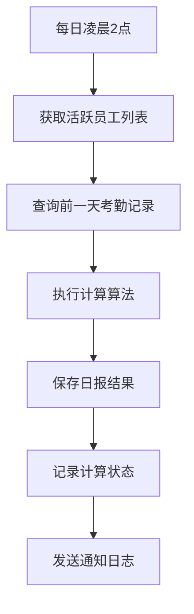
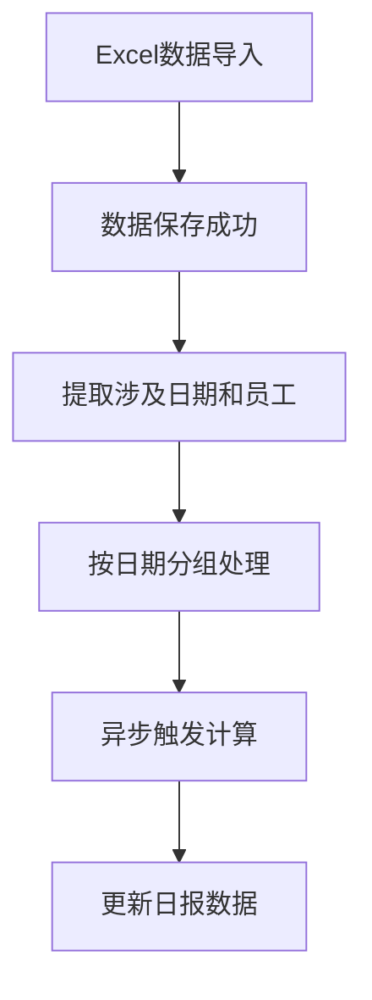

# 考勤日报自动计算功能使用手册

## 📖 功能概述

考勤日报自动计算功能是基于员工打卡记录自动生成每日考勤统计报告的智能化系统。该功能能够自动分析考勤数据，计算迟到、早退、加班、公出等各项指标，为HR管理提供准确的数据支持。

## ✨ 核心特性

### 🤖 智能计算引擎
- **迟到统计**：自动计算迟到时长（精确到分钟）
- **早退统计**：自动识别早退行为并计算时长
- **加班统计**：基于打卡结果自动识别加班时间
- **实际工作时长**：计算最早上班到最晚下班的实际工作时间
- **公出识别**：智能识别备注中的公出、外出等关键词
- **缺勤判断**：自动识别无打卡记录或标记为缺勤的情况

### ⏰ 自动化执行
- **定时计算**：每日凌晨2点自动计算前一天的考勤日报
- **导入触发**：Excel考勤数据导入完成后自动触发日报计算
- **手动触发**：支持指定日期和员工范围的手动计算

## 📊 报告字段说明

| 字段名 | 说明 | 计算规则 |
|--------|------|----------|
| 工号 | 员工工号 | 来自员工基础信息 |
| 真实姓名 | 员工姓名 | 来自员工基础信息 |
| 员工昵称 | 员工昵称 | 来自员工基础信息 |
| 公司邮箱 | 员工邮箱 | 来自员工基础信息 |
| 一级部门 | 所属部门 | 来自员工基础信息 |
| 迟到时长（分钟） | 当天迟到总时长 | max(0, 实际打卡时间 - 应打卡时间) |
| 早退时长（分钟） | 当天早退总时长 | max(0, 应打卡时间 - 实际打卡时间) |
| 加班时长（小时） | 当天加班总时长 | 基于打卡结果为"加班"的记录计算 |
| 实际工作时长（小时） | 实际在岗时间 | 最晚下班时间 - 最早上班时间 - 午休时间 |
| 公出时长（小时） | 公出时间 | 基于备注关键词识别，每条记录按4小时计算 |
| 班次 | 工作班次 | 来自考勤记录或员工配置 |
| 计算状态 | 处理状态 | SUCCESS/FAILED/PENDING/PROCESSING |
| 计算消息 | 处理信息 | 计算过程中的提示或错误信息 |

## 🚀 使用方法

### 1. 查询考勤日报

#### API调用方式
```bash
GET /api/reports/daily-reports?employeeId=1&startDate=2024-01-01&endDate=2024-01-31&page=1&pageSize=20
```

#### 查询参数说明
- `employeeId` (可选)：指定员工ID
- `startDate` (可选)：开始日期，格式：YYYY-MM-DD
- `endDate` (可选)：结束日期，格式：YYYY-MM-DD
- `calculationStatus` (可选)：计算状态筛选
- `page` (可选)：页码，默认1
- `pageSize` (可选)：每页数量，默认20

#### 响应示例
```json
{
  "data": [
    {
      "id": 1,
      "employeeNo": "HM202401001",
      "realName": "张三",
      "reportDate": "2024-01-15",
      "lateMinutes": 10,
      "overtimeHours": 2.5,
      "actualWorkingHours": 8.5,
      "businessTripHours": 0,
      "calculationStatus": "success"
    }
  ],
  "total": 100,
  "page": 1,
  "pageSize": 20,
  "totalPages": 5
}
```

### 2. 手动触发计算

#### 批量计算
```bash
POST /api/reports/calculate
Content-Type: application/json

{
  "startDate": "2024-01-01",
  "endDate": "2024-01-31",
  "employeeId": 1,
  "forceRecalculate": true
}
```

#### 指定日期计算
```bash
POST /api/reports/trigger-calculation
Content-Type: application/json

{
  "date": "2024-01-15",
  "employeeIds": [1, 2, 3]
}
```

### 3. 查看计算状态统计

```bash
GET /api/reports/calculation-status?startDate=2024-01-01&endDate=2024-01-31
```

响应示例：
```json
{
  "total": 1000,
  "success": 950,
  "failed": 30,
  "pending": 15,
  "processing": 5
}
```

## 🔄 自动化流程

### 定时计算流程


### 导入触发流程


## ⚠️ 注意事项

### 1. 数据准确性要求
- 确保考勤记录的打卡时间准确
- 应打卡时间格式必须为 HH:mm
- 考勤日期必须为有效日期格式

### 2. 计算规则说明
- **午休时间**：默认扣除1小时，可根据业务需求调整
- **公出识别**：基于备注关键词「公出」、「外出」、「出差」等
- **加班认定**：必须打卡结果标记为"OVERTIME"才计入加班时长
- **缺勤判断**：无打卡记录或结果标记为"ABSENT"

### 3. 性能优化建议
- 大量数据计算时建议分批处理
- 避免频繁的手动重复计算
- 定期清理过期的计算日志

### 4. 错误处理机制
- 单个员工计算失败不影响整体流程
- 失败记录会保留详细错误信息
- 支持对失败记录进行重新计算

## 🛠️ 故障排查

### 常见问题及解决方案

#### Q1: 计算结果不准确
**可能原因：**
- 考勤记录数据有误
- 应打卡时间格式不正确
- 打卡结果分类错误

**解决方案：**
1. 检查原始考勤数据的准确性
2. 验证时间格式是否为 HH:mm
3. 确认打卡结果分类是否正确

#### Q2: 计算状态显示FAILED
**可能原因：**
- 员工信息不完整
- 数据库连接异常
- 时间解析失败

**解决方案：**
1. 查看calculationMessage字段的详细错误信息
2. 检查员工基础信息是否完整
3. 使用forceRecalculate=true重新计算

#### Q3: 定时任务未执行
**可能原因：**
- 定时任务服务未启动
- 服务器时间不准确
- 系统资源不足

**解决方案：**
1. 检查@nestjs/schedule模块是否正确安装
2. 验证服务器时间设置
3. 查看系统日志排查错误

## 📈 使用最佳实践

### 1. 数据导入最佳实践
- 建议在非高峰时间进行大批量数据导入
- 导入前先备份现有数据
- 导入后验证计算结果的准确性

### 2. 查询优化建议
- 使用日期范围限制查询结果
- 避免查询过长时间跨度的数据
- 合理设置分页参数

### 3. 监控建议
- 定期检查计算失败率
- 监控系统资源使用情况
- 建立数据准确性验证机制

## 📞 技术支持

如遇到技术问题，请提供以下信息：
1. 具体的错误信息或异常行为描述
2. 相关的API请求参数
3. 系统日志片段
4. 数据样本（脱敏后）

---

**文档版本**：v1.0  
**创建日期**：2024年12月  
**更新日期**：2024年12月  
**维护团队**：HR系统开发组
